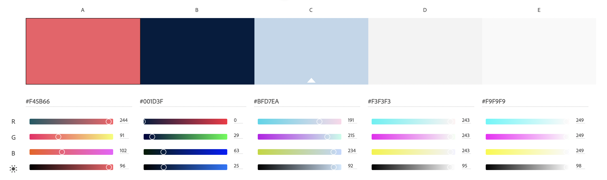

# Rezilient Health Frontend Take-Home Challenge

The Rezilient Health Frontend Take-Home Challenge is designed to evaluate your skills with JavaScript, TypeScript, React and basic UX/UI design.

## What To Expect

##### Format

You will be building two very simple components; a **patient list** and **patient view** with some basic filter and sorting features.

At Rezilient Health, we value good UX/UI instincts and, because of that, this challenge follows a very open format where we do not provide a mockup to follow. You will be using [Material UI](https://mui.com/) as your framework along with some basic brand and style assets. However, it is your job to build a simple UX/UI and be ready to defend your decisions.

##### Evaluation

You will be evaluated on the following:

- Your demonstrated knowledge of JavaScript and TypeScript fundamentals.
- Your demonstrated knowledge of React and its best practices.
- How well you design, layout and implement your UX/UI with [Material UI](https://mui.com/).
- How clean and organized your code is.

##### Time

There is no set time limit to complete this challenge, however, we anticipate that it should take you between 2 to 3 hours. We understand that your time is extremely valuable and, as such, we have provided you with starter code and all the tools you need to complete the challenge in that time.

## Getting Started

##### Requirements

You will need the latest LTS version of **NodeJS** and **npm** (or **yarn**) to install dependencies.

##### Installation

To get started, please **_fork_** this repository using your own GitHub account. Feel free to name it whatever you like.

Once you have forked this repository, you can clone it locally and install its dependencies (**note the** `--legacy-peer-deps` option) from the root directory. Once the dependencies are installed you can run the application.

```
$ npm install --legacy-peer-deps
$ npm run start
```

Once the application starts you can visit `http://localhost:3000` to access the application from whatever browser you prefer.

##### Submission

Once you are ready and have committed all your code to your forked repository, please provide the public link to your forked repository in your email response for review.

## Instructions

For this challenge you will be building one component that gets a list of patients from an API and displays them to the user. The second will display a single patient to the user. Please follow the user stories below to come up with your solution.

##### User Stories

- As a user I can see a list of all patients displaying the following data points: `ID, Full Name, Email, Sex, Created At`.
- As a user I can filter patients by Sex.
- As a user I can sort patients by Last Name.
- As a user I view all patient data points on a linkable page.

##### Coding It Out

You should be able to complete the challenge by adding code to the files in `src/components`. You have three starter files there `Layout.tsx`, `ListPatients.tsx` and `ViewPatient.tsx`. You may add additional files as you see fit.

Please **_only_** add CSS to `src/App.css` for any custom styling.

##### Material UI & Other Libraries

Please **_only_** use [Material UI](https://mui.com/) for the UI framework. It is already included as a dependency so all you need to do is import whatever you need. All Material UI documentation can be found here: https://mui.com/material-ui/

Feel free to add additional libraries as you see fit.

##### Mock API & Data

We have also provided mock data and API calls. Please do not modify any code in the `src/mocks` folder. You will only need to make API calls. To do so, uncomment the import code in `ListPatients.tsx` and `ViewPatient.tsx`. Note that each call is _asynchronous_. There are two functions, `getPatients` and `getPatient`. Please see `src/mocks/api.ts` for usage.

##### Assets

You also have access to some basic assets in the `src/assets` folder. There is a light and dark logo if you would like to use. You can also find a color palette (shown below) that has some brand colors you can use.


